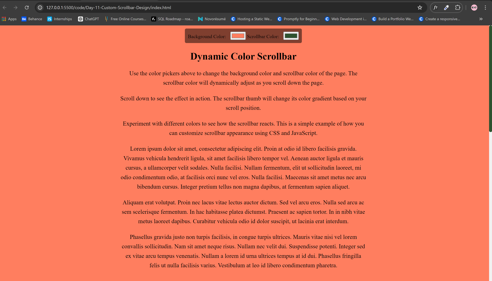

<h1>Dynamic Color Scrollbar with Color Picker</h1>

This project demonstrates how to create a dynamic color scrollbar in a web page using HTML, CSS, and JavaScript. The scrollbar color changes dynamically based on the user's scroll position. Additionally, users can customize the background color and scrollbar color using color pickers.

<h2>Features</h2>
<ul>
    <li><strong>Dynamic Scrollbar Color:</strong> The color of the scrollbar thumb changes gradually as the user scrolls through the page.</li>
    <li><strong>Color Pickers:</strong> Users can select custom colors for the background and scrollbar using color pickers.</li>
    <li><strong>Text Color Adjustment:</strong> Text colors for headings and paragraphs dynamically adjust based on the background color's brightness to ensure readability.</li>
    <li><strong>Responsive Design:</strong> The page layout adjusts to different screen sizes for a seamless user experience.</li>
</ul>

<h2>Preview</h2>

<h2>Getting Started</h2>
<ol>
    <li><strong>Clone the Repository:</strong> Open your terminal and run the following command to clone the repository to your local machine:
        <pre><code>git clone https://github.com/Yashi-Singh-1/Day-11-Custom-Scrollbar-Design.git</code></pre>
        Replace <code>https://github.com/Yashi-Singh-1/Day-11-Custom-Scrollbar-Design.git</code> with the actual URL of your GitHub repository.
    </li>
    <li><strong>Open <code>index.html</code> in a Web Browser:</strong> Double-click on the <code>index.html</code> file to view the project in your default web browser.</li>
    <li><strong>Adjust Color Settings:</strong> Use the color pickers to customize the background and scrollbar colors.</li>
    <li><strong>Scroll Through the Page:</strong> Observe how the scrollbar color changes dynamically as you scroll through the page.</li>
</ol>

<h2>Contributing</h2>

To contribute to this project, follow these steps:

<ol>
    <li><strong>Fork the Repository:</strong> Click on the "Fork" button at the top right corner of the repository's page on GitHub.</li>
    <li><strong>Clone Your Fork:</strong> Clone the forked repository to your local machine using Git.</li>
    <li><strong>Make Changes:</strong> Make your desired changes to the codebase.</li>
    <li><strong>Commit Your Changes:</strong> Commit your changes with a descriptive commit message.</li>
    <li><strong>Push to Your Fork:</strong> Push your changes to your forked repository on GitHub.</li>
    <li><strong>Submit a Pull Request:</strong> Navigate to the "Pull Requests" tab of your forked repository and submit a pull request.</li>
</ol>

<h2>License</h2>

This project is licensed under the MIT License - see the <code>LICENSE</code> file for details.

<footer>
    
&copy; 2024 Yashi Singh

</footer>